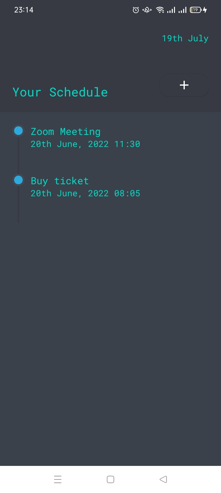
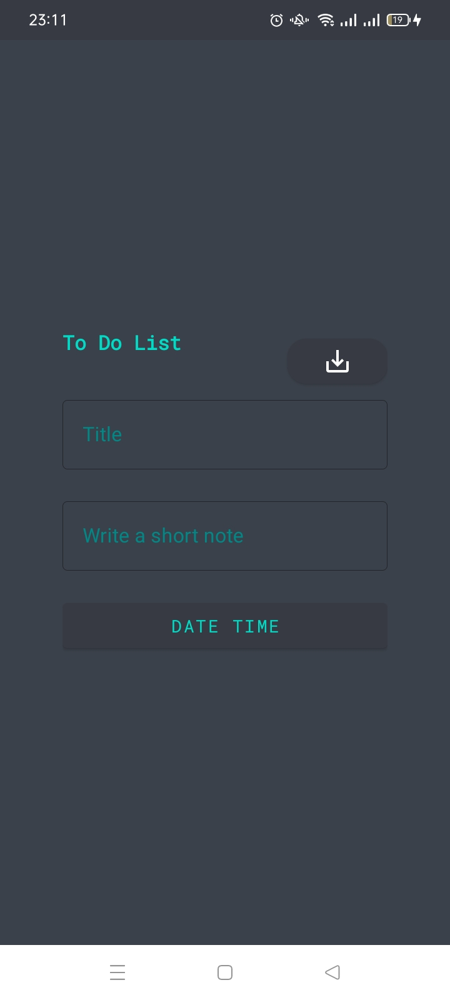
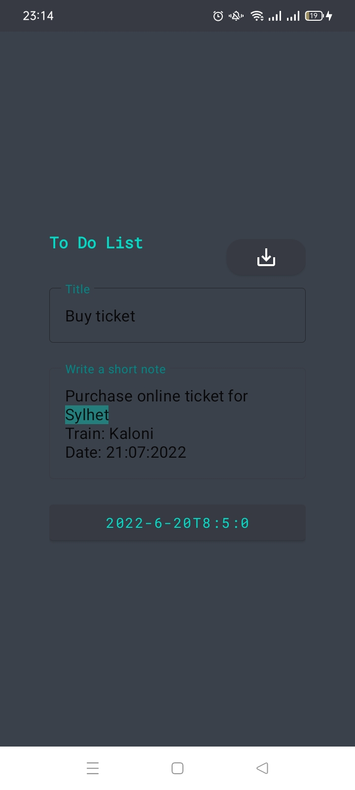

# TODO LIST
> A genaral purpose application for tracking user's activity.

User can keep their daily activities record into this application.
Can take a glance of the schedule in the list and also in details.
This application is also very usefull to those who has a tendency to forget their task.
You can also modify your TODO LIST like update and delete.

## Screenshots

## Description

The application starts from a splashScreen and then it shows a list of schedules.
Their is a "+" button for recording a new schedule. User can also tap any schedule and view in details and can update or delete if needed.
